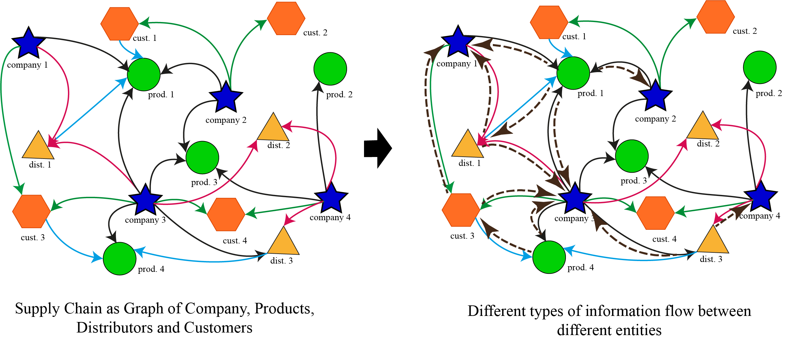

# Graph Neural Networks in Supply Chain Optimization: Concepts, Perspectives, Dataset and Benchmarks
- Authors: Azmine Toushik Wasi, MD Shafikul Islam, Adipto Raihan Akib, and Mahathir Mohammad Bappy
- Affiliation: Shahjalal University of Science and Technology, Sylhet, Bangladesh; Louisiana State University, Louisiana, USA;
Computational Intelligence and Operations Laboratory, Sylhet, Bangladesh

---

**Abstract:** Graph Neural Networks (GNNs) have recently gained traction in transportation, bioinformatics, language and image processing, but research on their application to supply chain management remains limited. Supply chains are inherently graph-like, making them ideal for GNN methodologies, which can optimize and solve complex problems. 
The barriers include a lack of proper conceptual foundations, familiarity with graph applications in SCM, and real-world benchmark datasets for GNN-based supply chain research. To address this, we discuss and connect supply chains with graph structures for effective GNN application, providing detailed formulations, examples, mathematical definitions, and task guidelines. Additionally, we present a multi-perspective real-world benchmark dataset from a leading FMCG company in Bangladesh, focusing on supply chain planning.
We discuss various supply chain tasks using GNNs and benchmark several state-of-the-art models on homogeneous and heterogeneous graphs across six supply chain analytics tasks. Our analysis shows that GNN-based models consistently outperform statistical ML and other deep learning models by around 10-30\% in regression, 10-30\% in classification and detection tasks, and 15-40\% in anomaly detection tasks on designated metrics.
With this work, we lay the groundwork for solving supply chain problems using GNNs, supported by conceptual discussions, methodological insights, and a comprehensive dataset.

---

The `raw` folder contains the raw datasets. Homogeneous and heterogeneous forms in `raw\homogeneous\` and `raw\heterogeneous\` respectively. Researchers have to choose both modality, and considerations (hoe they want to build the graph) first. The, develop the graphs and formulate problems accordingly.

---

